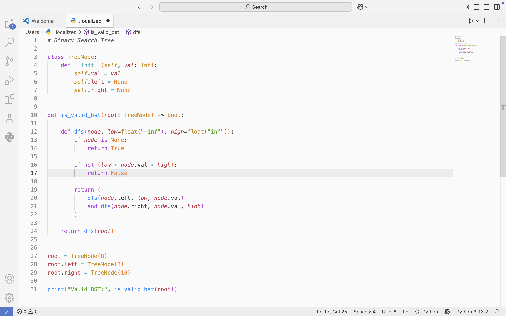

 A light VS Code theme inspired by One Dark Pro's syntax colors
# One Light Pro Enhanced

A light VS Code theme based on One Dark Pro's syntax highlighting

One Light Pro brings the familiar, high-contrast syntax colors of One Dark Pro
to a clean light interface.

## Features

- Light interface inspired by One Dark Pro
- High-contrast syntax highlighting
- Customized Python syntax colors
- Light notebook and DataFrame styling

## Installation

Install **One Light Pro** from the Visual Studio Code Marketplace and select it
from:

`Preferences: Color Theme → One Light Pro`

## Credits

One Light Pro is based on and derived from
[One Dark Pro](https://github.com/Binaryify/OneDark-Pro).
